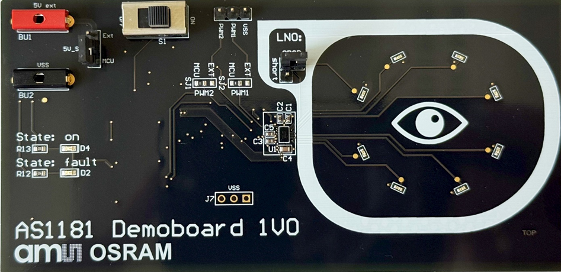
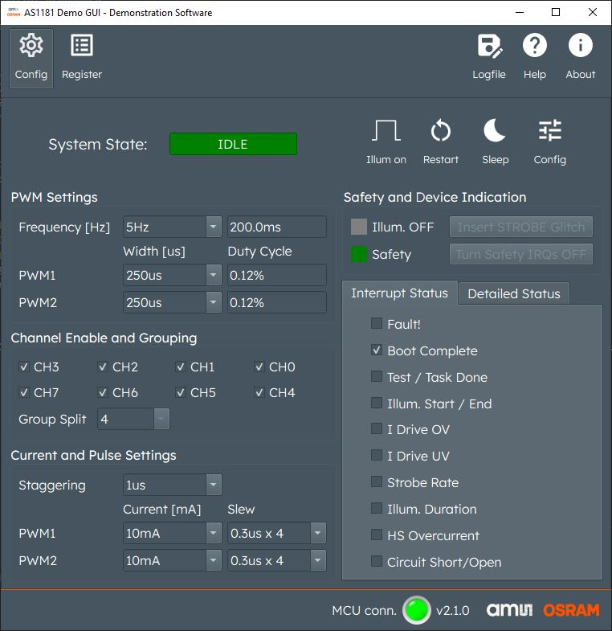
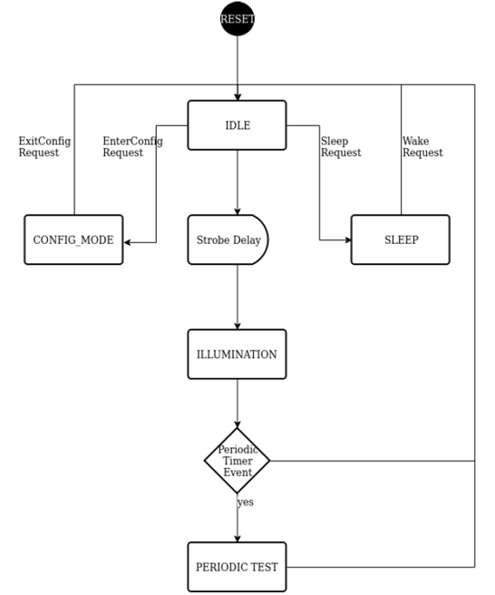
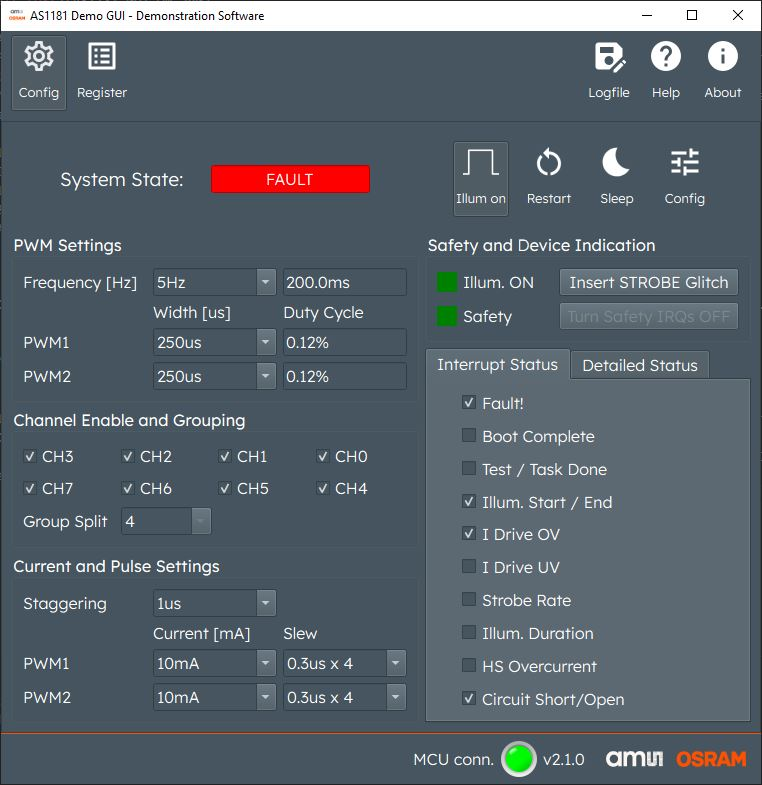
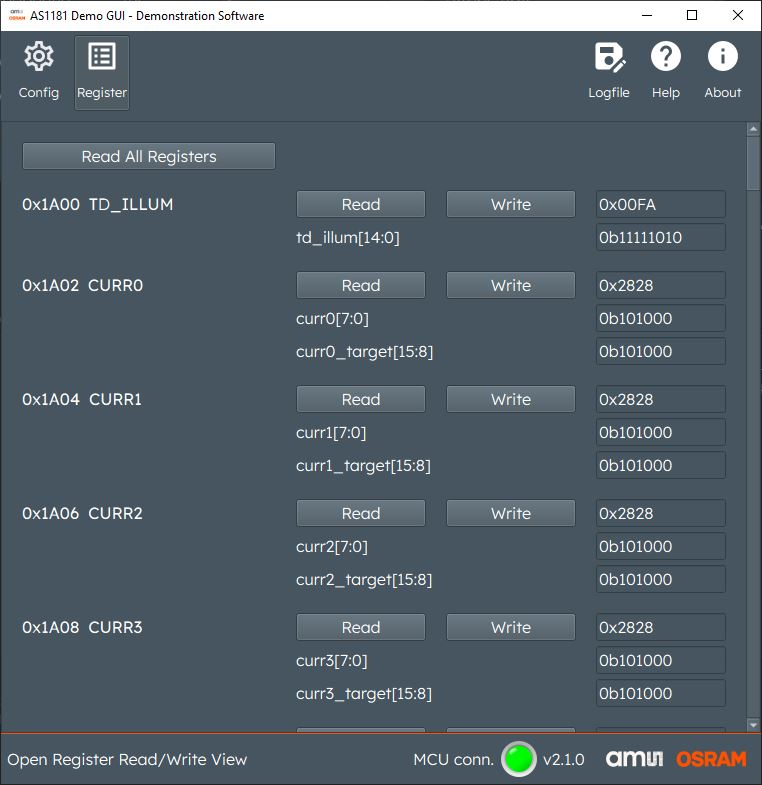

# AS1181
AS1181 is an 8-channel highly integrated self-contained LED/VCSEL driver for near to eye applications such as Augmented Reality (AR) and Virtual Reality (VR) glasses. The device integrates extended safety monitoring functions to ensure eye safe operation. These safety monitors include LED short detection, LED open detection, LED overcurrent protection, LED on time monitor as well as temperature shutdown and a built-in-self test (BIST).
The device is configurable via a serial wire interface (I²C or I3C) with interrupt and provides two Strobe/PWM inputs to synchronize illumination with up to two external cameras for binocular eye tracking systems.
The LED current is individually programmable per channel, and it can drive up to 2 IR LEDs per current sink with a minimum ON time of 10μs and a maximum current of 66mA per channel.
General purpose LED driving applications can be supported via a direct PWM input applied at the Strobe pin and it can drive RGB or white LEDs considering a maximum forward voltage of 5V.
The device comes in a tiny wafer-level-chip-scale package (WLCSP) with 0.4mm pitch and dimensions of 2.9mm x 1 .75mm x 0.5mm (L x W x H).
## AS1181 Demoboard
The main purpose of this platform is to provide customers tools to evaluate AS1181.
This platform includes a simple PC GUI software to allow configuration of the device and test different modes.
On the bottom side of the PCB a “seeed studio ESP32” MCU is placed to act as bridge between USB and I2C/I3C of AS1181.

## How to get started?

- Launch AS1181 demo_app.exe from downloaded repository
- Connect USB-Type C Cable
- Switch S1 to "ON" position
>**D4 (green LED) = ON, System State = IDLE, Interrupt "Boot complete" is set**

## System States of AS1181
- After power on reset AS1181 powers up in IDLE mode.
- From IDLE it is possible to access “SLEEP” or “CONFIG” mode by clicking the respective buttons in the GUI.
- 
-     Note 1: ILLUMINATION can only be started from IDLE state. Before pressing “Illum ON” Config or Sleep mode needs to be left by clicking on it again. 
-     Note 2: Every configuration change shall be done in CONFIG mode
## Turning on Illumination
AS1181 has several modes to trigger illumination:
- Illumination time set and controlled by AS1181 and triggered via external strobe 
- 1 PWM input for all channels (direct PWM mode)
- 2 PWM inputs for configurable group of channels (direct PWM mode with 2 inputs)
- AS1181 Demoboard is pre-configured for 2 PWM inputs (**default configuration**)
    - ESP32 is generating PWM signals according to the “PWM Settings Tab”
    - User can configure Frequency and Duty Cycle of both PWM signals

- Depending on the “Group Split” configuration the PWM inputs are assigned to different channels. e.g.:
    - Group Split 4 = PWM 1 for CH0-3 and PWM 2 for CH4-CH7
    - Group Split 2 = PWM 1 for CH0-1 and PWM 2 for CH2-CH7 
-     Note: For more details please refer to the AS1181 Datasheet

## Force Error Detection
- AS1181 provides several safety checks. Some can be simulated by removing Jumper “OPEN” or setting Jumper “SHORT”. This simulates OPEN or SHORTED LED on channel 0.
As soon as the Jumper is removed during active ILLUMINATION the System State is changing to “FAULT”, D2 illuminates “RED” and respective Interrupts are set.
- It is also possible to simulate a too long illumination/exposure time by configuring the PWM generators in such a way that the PWM ON time is larger than TD_ILLUM_MAX default setting. 
-     Note: TD_ILLUM_MAX default setting is 4ms. Configuration can be changed by accessing the register map tab

-     Note: To clear the “FAULT” – “FAULT” needs to be removed by setting the jumper again and button “Restart” needs to be pressed.

## Other Configuration possibilities with the GUI Software
- In CONFIG Mode it is also possible to configure “Staggering”: This is a configurable delay [µs] from channel to channel (TD_STAGGER)
- For very short LED pulses also the Slew Rate of the current sources can be configured. Slew Rate is defined with step time [µs] x number of steps.
- For advanced use all registers of AS1181 can be accessed via the “Register” Tab.
- 
-     Note: AS1181 has many configuration possibilities, this guide only describes a first starting point. For more details please check the AS1181 Datasheet and respective application notes.
